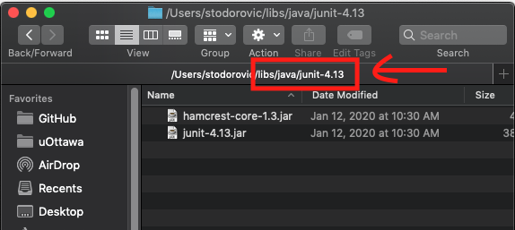
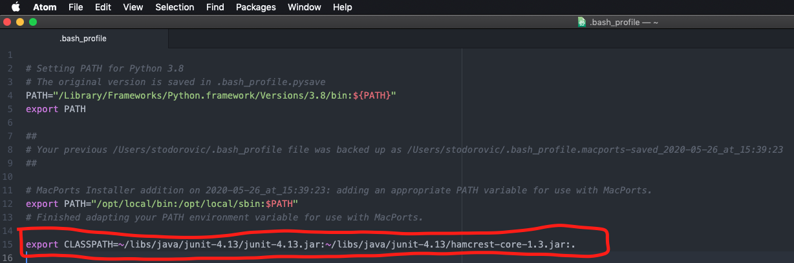

## JUnitPreReqInstall for Mac

For use with all labs as of Jan. 16, 2020

·  Downloads latest junit-4.13.jar and hamcrest-core-1.3.jar

·   Adds CLASSPATH environment variable that contains .jar files above

### Instructions

1.  Run the command in your Terminal

`curl -O https://raw.githubusercontent.com/steftodor/iti1121/master/JUnitPreReqInstallMac/JUnitInstaller.sh && chmod +x JUnitInstaller.sh && ./JUnitInstaller.sh`

2.   Process is completed automatically
3.   Quit Terminal before using commands that may require the installed files.   
### Video Demonstration

[YouTube Video: JUnit Install on MacOS](http://www.youtube.com/watch?v=RX8NSHJieds "JUnit Install on MacOS")

### Example of completed Install

