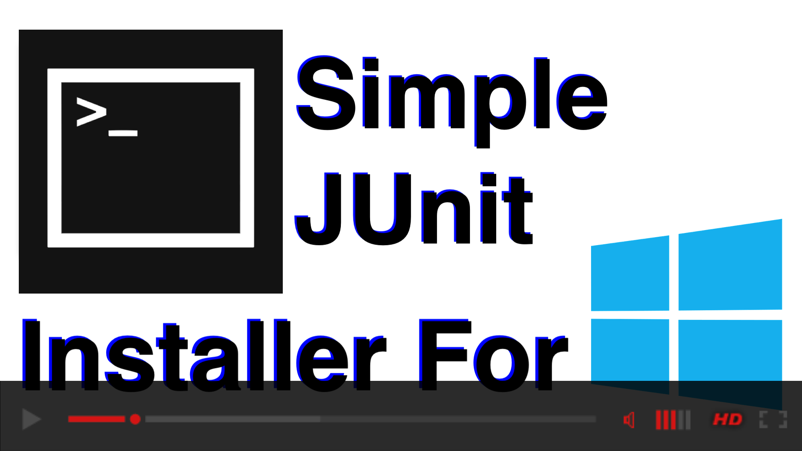
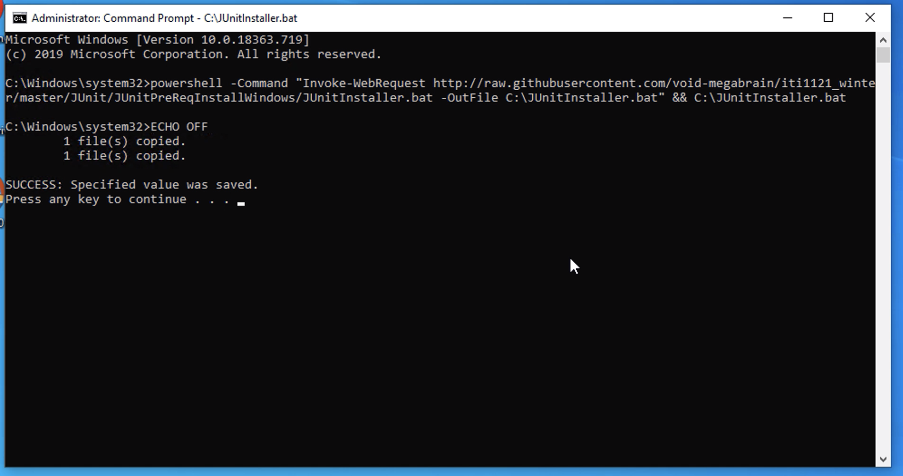
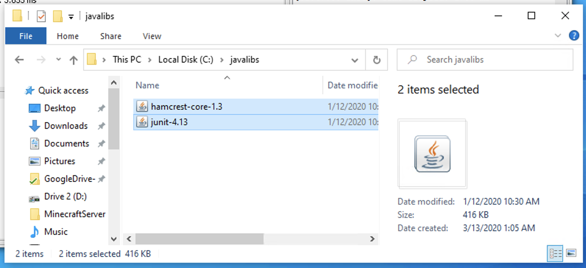
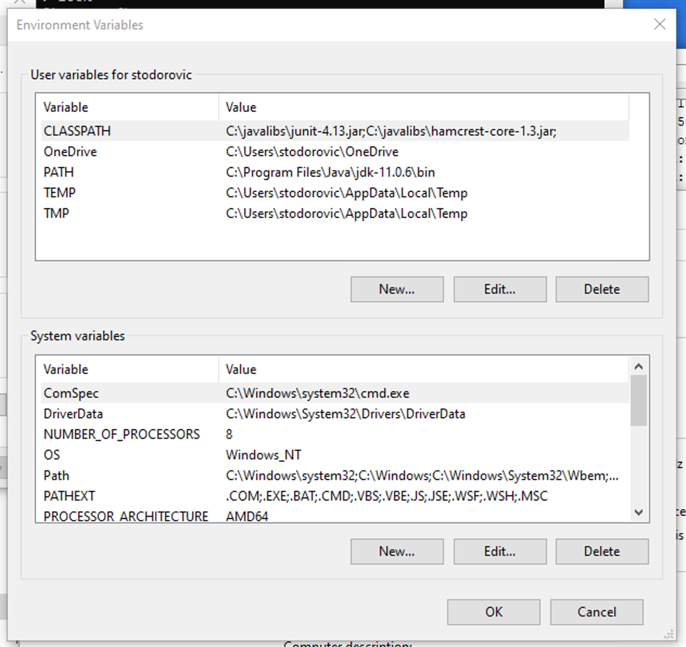

## JUnitPreReqInstall for Windows

For use with all labs as of Jan. 16, 2020

·  Downloads latest junit-4.13.jar and hamcrest-core-1.3.jar

·   Adds CLASSPATH environment variable that contains .jar files above

### Instructions

1.  Run the Command in your Command Prompt as Administrator

`powershell -Command "Invoke-WebRequest http://raw.githubusercontent.com/steftodor/iti1121/master/JUnitPreReqInstallWindows/JUnitInstaller.bat -OutFile C:\JUnitInstaller.bat" && C:\JUnitInstaller.bat`

2.   Process is completed automatically
3.   Quit Command Prompt before using commands that may require the installed files.   
### Video Demonstration

### Example of completed Install

